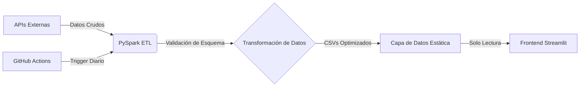

# Terminal Inversionista: Plataforma de Analítica Institucional

**Terminal Inversionista v2.0** es un dashboard financiero de alto rendimiento diseñado para replicar la densidad de información y la utilidad de las terminales institucionales (ej. Bloomberg). A diferencia de los dashboards estándar, este proyecto implementa una **arquitectura desacoplada tipo Serverless Data Lakehouse**, separando el procesamiento pesado de datos de la interfaz de usuario para garantizar una latencia inferior al segundo.

## 🏗 Arquitectura del Sistema

La solución sigue un patrón estricto de **Extracción, Transformación y Carga (ETL)** orquestado vía CI/CD, demostrando preparación para escalabilidad:

### 1. Capa de Extracción (Ingesta)
- **Fuentes:** Integración con Yahoo Finance (Renta Variable Global, Macro) y Mindicador (Indicadores Económicos de Chile).
- **Estrategia:** Implementación de recuperación *"Fast Info"* con algoritmos de redundancia (fallback) y proxies para minimizar la latencia de las APIs y asegurar la disponibilidad de índices locales (ej. IPSA).

### 2. Capa de Transformación (Apache Spark)
- **Motor:** Se utiliza **PySpark** en lugar de Pandas para demostrar capacidades de Big Data y computación distribuida.
- **Cumplimiento de Esquema:** Uso de definiciones `StructType` para imponer tipado estricto, previniendo fallos en producción causados por cambios inesperados en las APIs (Schema Drift).
- **Lógica:** Cálculo de Medias Móviles (SMA 20/50/200) y crecimiento año contra año (YoY) mediante funciones de ventana optimizadas.

### 3. Capa de Servicio (Frontend)
- **Framework:** **Streamlit**, altamente customizado vía Inyección de CSS para lograr un diseño "Full Bleed" (borde a borde) y eliminar la apariencia estándar del framework.
- **Gestión de Estado:** Implementación de `st.session_state` para persistir las preferencias del usuario (Watchlists, Modo Oscuro/Claro) durante la sesión.
- **Visualización:** Gráficos **Plotly** interactivos que incluyen análisis comparativo de doble eje, gráficos de cascada (Waterfall) para estructuras de P&L, y medidores (Gauges) para análisis de sentimiento.

---

## 🚀 Características Técnicas Clave

### Pipeline CI/CD Automatizado
El proyecto se ejecuta bajo un esquema de **Cron Serverless** utilizando GitHub Actions.
- **Workflow:** Ejecución diaria automática (23:00 UTC) al cierre de mercado.
- **Auto-Healing:** El pipeline realiza commits automáticos de los nuevos datasets procesados al repositorio, actuando como una base de datos auto-actualizable sin servidores dedicados.

### UI/UX de "Grado Institucional"
- **Watchlist Dinámica:** Los usuarios pueden agregar/eliminar activos en tiempo real.
- **Sistema de Temas:** Alternancia entre "Bloomberg Dark Mode" y "Standard Light Mode".
- **Cinta de Tickers (Tape):** Animación CSS pura para visualizar el sentimiento del mercado de un vistazo.
- **Análisis de Puente (Bridge):** Visualización automática de la estructura de resultados (Ingresos -> Costos -> Utilidad Bruta -> Utilidad Neta).
