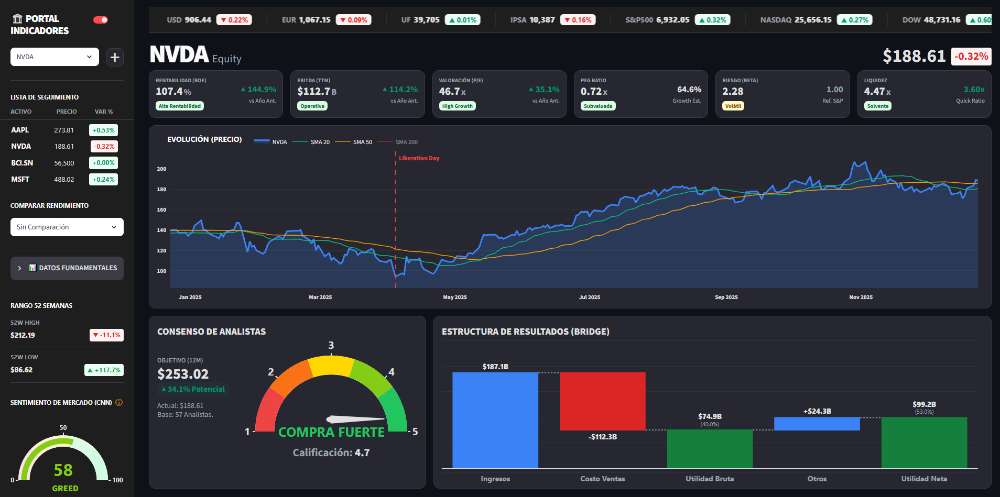

# Terminal Inversionista: Plataforma de Análisis de Indicadores


[](https://indicadores-nfhczfntub2eaywlowyxf9.streamlit.app/)

<!-- PORTADA VISUAL -->
<div align="center">
  
  <br>
  <em>Vista de Analítica Institucional (Modo Oscuro) - Análisis en Tiempo Real</em>
  <br><br>
  <h3> Demo en Vivo</h3>
  
  <br>
</div>
<!-- FIN PORTADA -->


**Terminal Inversionista v2.0** es un dashboard financiero diseñado para centralizar métricas clave en una interfaz limpia. Para lograr costo cero y mantenimiento mínimo, implementé una arquitectura serverless donde GitHub actúa como orquestador y capa de almacenamiento, eliminando la necesidad de servidores dedicados.

## Arquitectura del Sistema

La solución sigue un patrón estricto de **Extracción, Transformación y Carga (ETL)** orquestado vía CI/CD.

```mermaid
graph LR
    A[Jupyter/Colab Prototyping] -->|Refactorización| B(Script PySpark);
    B -->|Orquestación| C[GitHub Actions];
    C -->|Datos Procesados| D[Repositorio (Data Layer)];
    D -->|Lectura| E[Frontend Streamlit];
    F[GitHub Actions] -->|Trigger Diario| B;
```
### 1. Desarrollo del ETL (De Notebook a Producción)
- **Prototipado:** La lógica de extracción y transformación se desarrolló inicialmente en **Google Colab (Jupyter Notebooks)** para iteración rápida.
- **Producción:** El código se consolidó en un script de Python estándar (`etl_spark.py`) para que pueda ejecutarse de forma autónoma.
- **Motor:** Se utiliza **PySpark** con definiciones estrictas de esquema (`StructType`). Esto previene errores silenciosos en producción si las APIs cambian sus formatos de datos.

### 2. Orquestación (GitHub Actions vs Airflow)
- **Decisión de Técnica:** Para un pipeline batch de ejecución diaria, **Apache Airflow** resultaba sobredimensionado. Opté por **GitHub Actions** para mantener el código y la orquestación en el mismo lugar, aprovechando los runners gratuitos de GitHub para procesar los datos con PySpark sin infraestructura adicional.

### 3. Capa de Servicio (Frontend)
- **Framework:** **Streamlit**, altamente customizado vía **Inyección de CSS** para maximizar el espacio de visualización.
- **Visualización:** Gráficos **Plotly** interactivos que incluyen análisis comparativo de doble eje, gráficos de cascada (Waterfall) para estructuras de P&L, y medidores (Gauges) para análisis de sentimiento.

---

## Características Técnicas Clave

### Actualización Automática de Datos
- **Persistencia de Datos**: En lugar de gestionar una base de datos externa, el sistema utiliza el propio repositorio para almacenar el histórico procesado. El bot realiza un commit automático tras el ETL, lo que dispara el re-despliegue inmediato en Streamlit.
- **Workflow:** Todos los días a las 23:00 UTC, el bot ejecuta el ETL.
### UI/UX
- **Watchlist Dinámica:** Los usuarios pueden agregar/eliminar activos en tiempo real.
- **Cinta de Tickers:** Animación CSS pura para visualizar el sentimiento de mercado.
- **Sistema de Temas:** Alternancia entre "Dark Mode" y "Light Mode".
- **Análisis Estructural:** Visualización tipo "Bridge" para entender la composición de resultados financieros.
